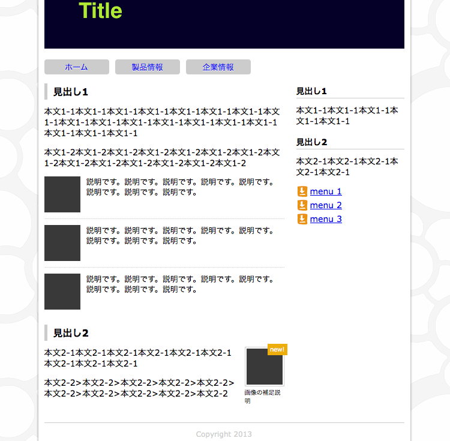

# Study Website HTML by dotinstall

## 概要
[実践！ウェブサイトを作ろう (全16回) - ドットインストール](http://dotinstall.com/lessons/website_html)を教材として利用できるか、自分でもやってみたよ。  

## 完成イメージ

## 感想
CSSフレームワークを使わずに、一から作っていく場合に必要なテクニックが盛り込まれてる印象かな。初学者は、やっておくべし。

2013年6月17日
